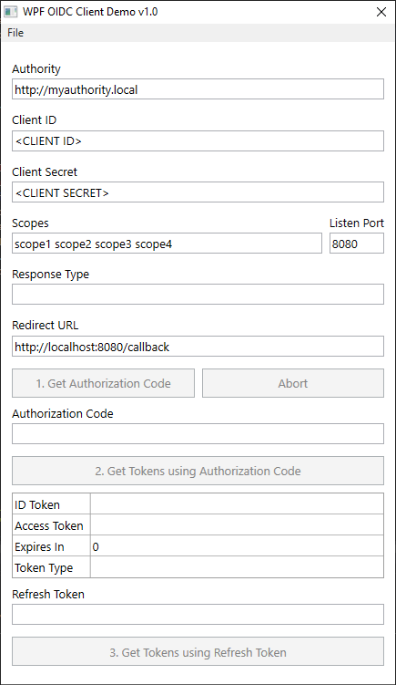

OidcClientDemo.WPF
=====================================

This tool is able to connect to [OpenID Connect](https://openid.net/specs/openid-connect-core-1_0.html) providers and ask for tokens.

Features
------------------------------
- [x] Authorization Code flow
- [x] Listen for HTTP requests in custom port

Screenshots
--------------------

Contributing
--------------
Contributions are welcome; either issues or PRs.

More resources
--------------------
- [OpenID Connect Core 1.0 Specification](https://openid.net/specs/openid-connect-core-1_0.html)
- [Diagrams of All The OpenID Connect Flows](https://medium.com/@darutk/diagrams-of-all-the-openid-connect-flows-6968e3990660)
- [IdentityModel library](https://github.com/IdentityModel/IdentityModel2)